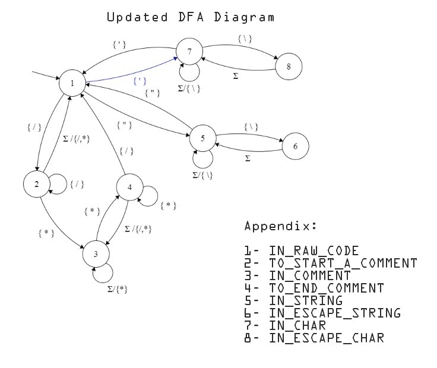

## Decommenter-Program

Perform the de-commenting task of gcc(or other c compile)

### This program is based on the follwing DFA

#### Limitations
this program will report error if there is unterminated comment.
But this will happen at runtime and it will not be indicated before
decommenting process.

-------- FOR THE INSTRUCTOR ----------

# project 01 : De-comment Program

Group Members

##### Dawit Yonas	        ATR/7114/09 
##### Daniel Geremew	    ATR/8104/09
##### Abenezier Kindie    ATR/5410/09

We have understood the usage of a DFA document,
It simplifies the how the code is written before writing the code itself.
Using the DFA document has cut down the developement time
and helped us as a reference when implementing with code.
We used 20 miniutes to design the dfa,and few more to implement the code.
Our classmates have helped in introducing and implementation of the DFA. 
The code works based on guidelines specified by the assignment document.
works with /* comment */ type comments.
